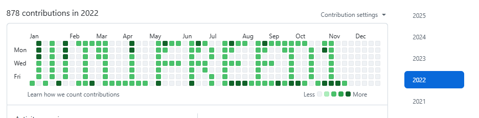

# GitHub Contribution Art – WILLFREED1

🟩 A Bash script that draws the name `WILLFREED1` on your GitHub contribution graph using backdated commits.

All commits are precisely aligned with GitHub’s 2022 calendar. You can also customize the design to draw hearts ❤️, stars ⭐, logos, or your own name.

---

## ✅ Result Preview

This is what the GitHub contribution graph looks like (for 2022):



---

## 🛠 How It Works

- Uses a 7×N pixel matrix (N ≤ 52 columns for 52 weeks)
- Each `"1"` in the matrix creates **5 commits** for darker green
- Commits are backdated using `GIT_AUTHOR_DATE` and `GIT_COMMITTER_DATE`
- The script pushes to the `main` branch to reflect on your profile

---
## ▶️ How to Run the Script

1. Make sure your GitHub repository is **empty** (no README, etc.)

2. Open Git Bash or your terminal and run:

```bash
chmod +x contribution-art.sh
./contribution-art.sh
```
Wait until the script finishes. It may take a few minutes depending on commit count.
Once finished, check if commits were generated:

```bash
cd contribution-art
git log --oneline | wc -l
```
You should see hundreds of commits if it worked.

Push your changes to GitHub:

```bash
git push origin main
```


## 🖌 Customize the Drawing

You can modify the `MATRIX` in `contribution-art.sh` to draw **anything**.

### Example: Heart ❤️

```bash
declare -a MATRIX=(
  "01100110"
  "11111111"
  "11111111"
  "01111110"
  "00111100"
  "00011000"
  "00000000"
)
